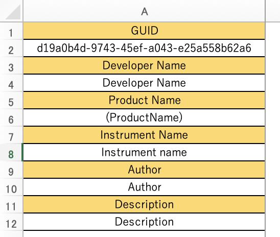

スプレッドシート(xlsx)
========================================

Excelなどスプレッドシート(xlsx)に対応したアプリケーションで編集が可能。

.. image:: resources/xlsx/overview.png
    :width: 100%

.. contents:: Contents
    :local:

----

基本情報
---------------------------------------

GUID
^^^^^^^^^^^^^^^^^^^^^^^^^^^^^^^^^^^^^^^

データベースがキースイッチを識別する一意のID。

**例**

.. code-block::

    d1efb793-600d-4f40-85dc-2253e1b05aa6

Developer Name
^^^^^^^^^^^^^^^^^^^^^^^^^^^^^^^^^^^^^^^

音源開発者情報

**例**

    .. code-block::

        Native Instruments

Product Name
^^^^^^^^^^^^^^^^^^^^^^^^^^^^^^^^^^^^^^^

製品名情報

**例**

    .. code-block::

        SYMPHONY ESSENTIALS – STRING ENSEMBLE

Instrument Name
^^^^^^^^^^^^^^^^^^^^^^^^^^^^^^^^^^^^^^^

音色名情報

**例**

    .. code-block::

        Violins 1

Author
^^^^^^^^^^^^^^^^^^^^^^^^^^^^^^^^^^^^^^^

キースイッチ作成者情報

**例**

    .. code-block::

        R-koubou

Description
^^^^^^^^^^^^^^^^^^^^^^^^^^^^^^^^^^^^^^^

キースイッチ説明

**例**

    .. code-block::

        My KeySwitch definition

アーティキュレーションの管理
---------------------------------------

.. image:: resources/xlsx/articulation.png
    :width: 100%

１行につき１つのアーティキュレーションを指定する。
MIDIメッセージを意味するそれぞれの列に対し、必要な値を記入する。

Articulation Name
^^^^^^^^^^^^^^^^^^^^^^^^^^^^^^^^^^^^^^^

アーティキュレーション名

NoteOn
^^^^^^^^^^^^^^^^^^^^^^^^^^^^^^^^^^^^^^^

MIDIノートオン

:Ch: MIDIチャンネル (1〜16)
:Note: MIDIノートナンバー (0〜127 または C-2〜G8)
:Velocity: ベロシティ (0〜127)

CC (Control Change)
^^^^^^^^^^^^^^^^^^^^^^^^^^^^^^^^^^^^^^^

:Ch: MIDIチャンネル (1〜16)
:No: CCナンバー (0〜127)
:Data: CCデータ (0〜127)

PC (Program Change)
^^^^^^^^^^^^^^^^^^^^^^^^^^^^^^^^^^^^^^^

:Ch: MIDIチャンネル (1〜16)
:Data: PCデータ (0〜127)

複数のMIDIメッセージを指定する場合
---------------------------------------------------

該当の列を複製し、数字部分を＋１する。

例１：MIDIノートオン
^^^^^^^^^^^^^^^^^^^^^^^^^^^^^^^^^^^^^^^^^^^^^^^^^^^

.. code-block::

    NoteOn Ch[1]
    Note[1]
    Velocity[1]

を複製し、

.. code-block::

    NoteOn Ch[2]
    Note[2]
    Velocity[2]

とする（数字部分を＋１する）

例２：MIDIコントールチェンジ
^^^^^^^^^^^^^^^^^^^^^^^^^^^^^^^^^^^^^^^^^^^^^^^^^^^

.. code-block::

    CC Ch[1]
    CC No[1]
    CC Data[1]

を複製し、

.. code-block::

    CC Ch[2]
    CC No[2]
    CC Data[2]

とする（数字部分を＋１する）

例３：MIDIプログラムチェンジ
^^^^^^^^^^^^^^^^^^^^^^^^^^^^^^^^^^^^^^^^^^^^^^^^^^^

.. code-block::

    PC Ch[1]
    PC Data[1]

を複製し、

.. code-block::

    PC Ch[2]
    PC Data[2]

とする（数字部分を＋１する）

複数のシートを１ファイルで管理する場合
---------------------------------------------------

必要な分シートを複製して１つのファイルに保持しておくことが可能。

.. note::

    GUIDは再利用できないため、手動で生成し記入する必要がある。

