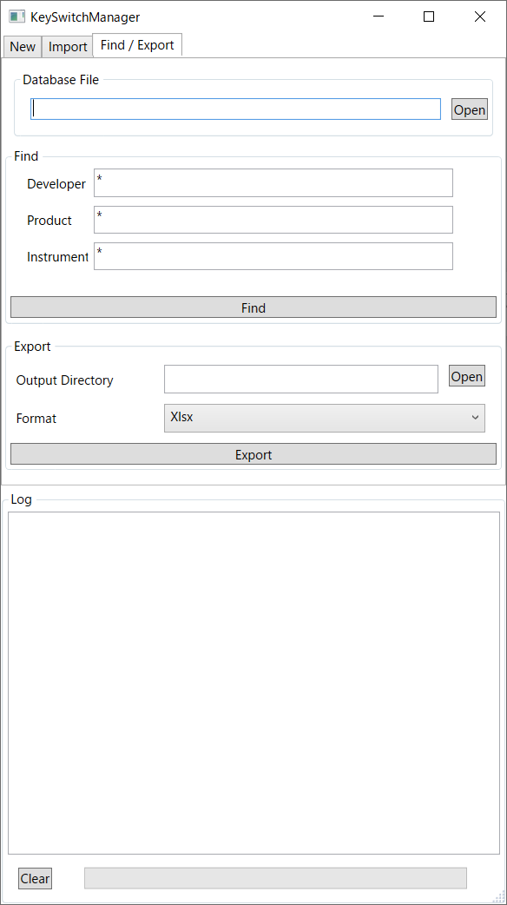

検索/エクスポート
============================================

DB内からキースイッチ定義の検索、指定DAWのフォーマットで出力する

検索
-------------------------------------------

======================= =====================================================
項目                    説明
======================= =====================================================
Database File           検索元DBファイルパス
Developer               検索条件：開発者名
Product                 検索条件：製品名
Instrument              検索条件：インストゥルメント名
Find                    検索開始
======================= =====================================================

エクスポート
-------------------------------------------

検索条件に合致するデータを出力する

======================= =====================================================
項目                    説明
======================= =====================================================
Output Directory        出力先ディレクトリ
Format                  出力データフォーマット
Export                  エクスポート開始
======================= =====================================================
