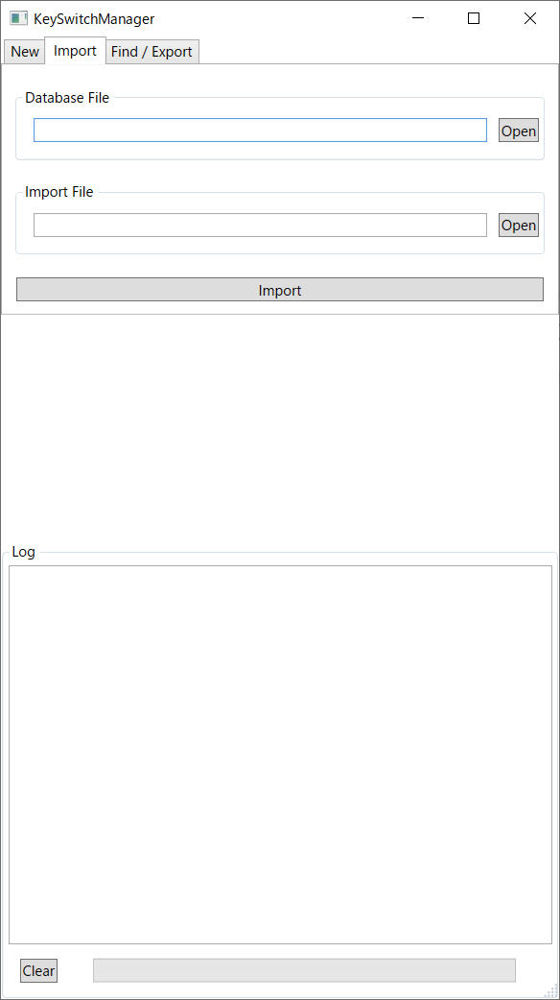

インポート
============================================

キースイッチ定義ファイル内容をDBに格納する

- :doc:`/contents/definition/index`

======================= =====================================================
項目                    説明
======================= =====================================================
Database File           保存先DBファイルパス。存在しない場合は新規作成。
Import File             キースイッチ定義ファイル
Import                  インポート開始
======================= =====================================================
